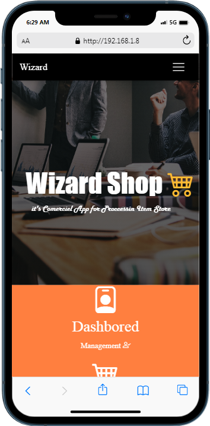

<div align="center">
<h1> Welcome in E-Commerce Shop Project </h1>

<p> this only contain the backend not the UI if you want full version feel free to contact</p>

<a href="https://img.shields.io/github/languages/top/Ahmed-Hamdy101/php-ecommerce-shop"> </a>
<a href="https://img.shields.io/github/stars/Ahmed-Hamdy101/php-ecommerce-shop?style=social"> </a>
<a href="https://img.shields.io/github/repo-size/Ahmed-Hamdy101/php-ecommerce-shop?style=plastic"> </a> <a href="https://twitter.com/Torn40535516"></a>
</div>


# Table of Contents :
  - [Project Description](#project-description)
  - [Requirement and installation](#requirement-and-installation)
  - [Project Structure](#project-structure)
  - [Why Prepare and SQL injection](#why-prepare-and-sql-injection)
  - [Display T-shirt](./#display-t-shirt)  
  - [API'S](#apis)
 </ul>


## Project Description 
   This PDO Project aim to how to implement the functionality of get product item,single item ,fetch result, get sizes information of products


## Requirement and installation
 - first you should have Apache server ,Xampp,mamp

 -  create configuration file and named it`config.php`
 - inside`config.php` add this

 ```php
         <?php
         define("DB_SERVER","127.0.0.1");
         define("BASE","/");
         define("DB_USERNAME","root");
         define("DB_PASSWORD","");
         define("DB_DATABASE","shop");
         define("DB_DATABASE_PORT","3306");

         try{
         $get_conn = new PDO("mysql:host=".DB_SERVER.";dbname=".DB_DATABASE.";port=".DB_DATABASE_PORT.";",DB_USERNAME,DB_PASSWORD);
         $get_conn->setAttribute(PDO::ATTR_ERRMODE,PDO::ERRMODE_EXCEPTION);
         $get_conn->exec("SET NAMES'utf8'");

         }
         catch(Exception $e){

         echo $e->getMessage();}

  ```  

- if you already have `phpmyadmin` go ahead and import it from [Shop SQL File](./database/shop.sql)


## Project Structure 

```
│   index.php
│   README.md
│
├───database
│       shop.sql
│
├───img
│   ├───images
│   │       004.jpg
│   │       mobile.png
│   │
│   └───products
│           shirt-101.jpg
│           shirt-102.jpg
│           shirt-103.jpg
│           shirt-104.jpg
│           shirt-105.jpg
│           shirt-106.jpg
│           shirt-107.jpg
│           shirt-108.jpg
│           shirt-109.jpg
│           shirt-110.jpg
│           shirt-111.jpg
│           shirt-112.jpg
│           shirt-113.jpg
│           shirt-114.jpg
│           shirt-115.jpg
│           shirt-116.jpg
│           shirt-117.jpg
│           shirt-118.jpg
│           shirt-119.jpg
│           shirt-120.jpg
│           shirt-121.jpg
│           shirt-122.jpg
│           shirt-123.jpg
│           shirt-124.jpg
│           shirt-125.jpg
│           shirt-126.jpg
│           shirt-127.jpg
│           shirt-128.jpg
│           shirt-129.jpg
│           shirt-130.jpg
│           shirt-131.jpg
│           shirt-132.jpg
│
└───_
    ├───app
    │   └───php
    │       │   config.php
    │       │   main-functions.php
    │       │
    │       └───tshirts
    │               tshirts.php
    │
    ├───css
    │   ├───bootstrap
    │   │       bootstrap.min.css
    │   │       mdb.min.css
    │   │
    │   └───icon
    │       │   bootstrap-icons.css
    │       │   bootstrap-icons.json
    │       │   bootstrap-icons.scss
    │       │
    │       └───fonts
    │               bootstrap-icons.woff
    │               bootstrap-icons.woff2
    │
    └───js
        ├───js
        │       anime.min.js
        │       bootstrap.min.js
        │       jquery.min.js
        │       mdb.min.js
        │       popper.min.js
        │
        └───script
                script.js
   ```
##  Display T shirt

```php

 <?php
 // include connection
include(./_/app/php/config.php);
// get all products in column
$get_conn=query('SELECT * FROM products');
$result->get_conn->fetchAll(PDO::FETCH_ASSOC);
// get last 4 products
$get_conn=query('SELECT * FROM products LIMIT 4 DESC');
$result->get_conn->fetchAll(PDO::FETCH_ASSOC);
  ?>

 ```

## Why Prepare and SQL injection 
 prepare method is import because hacker's can play around sql commands since we put query method and that accessible were sql injection is imagine if you have table and put beside the url

 > localhost:80/www/Shop/_/app/php/tshirts/tshirts.php?id=1 DROP TABLE ? FROM ? WHERE 1 =1

 ```sql
  --Result The table is drop out from database success query
  ```


## APIs

| API     | Response             | Response     | Description |
| :------------- | :------------- |:------------|:------------|
| localhost:80/www/Shop/_/app/php/tshirts/tshirts.php?id=1       |    GET    |  200| Get one single query by id and all sizes available of producs|
| localhost:80/www/Shop/index.php      | GET      | 200|  GET last 4 items in product table |
